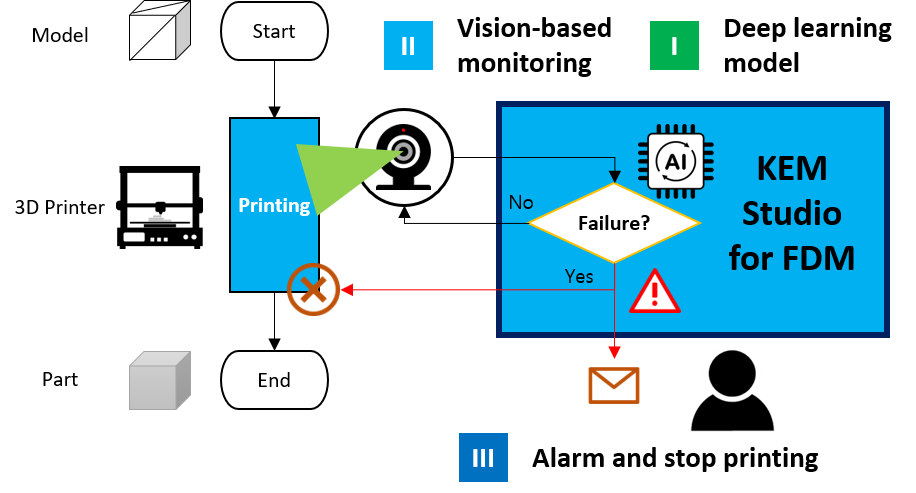

## Welcome to KEM Studio 

KEM (Keep an Eye on your Machine) Studio aims at a simple and affordable open source monitoring solution for manufacturing machines/devices.

KEM Studio for FDM is our first app for FDM-style 3D printers.
* Failure detection using deep learning
* Simple camera-based monitoring
* Automated email notification and printer stop

Developed by Hyungjung Kim and Hyunsu Lee at IDIM SNU

Contact by [email](mailto:hjkim81@snu.ac.kr)
